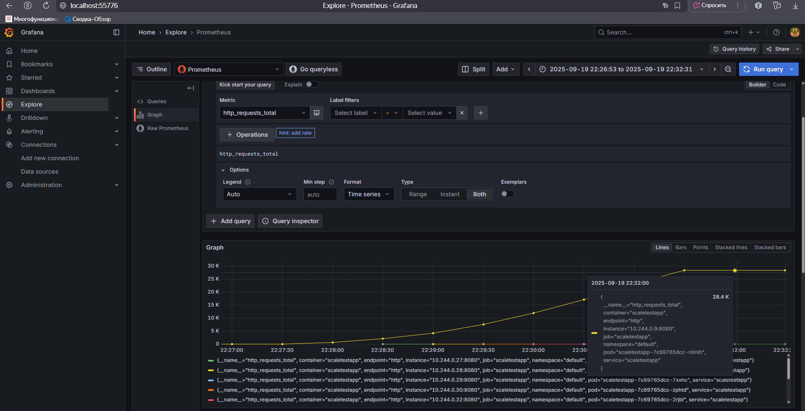

# Описание

## Проведение тестирования HPA - memory

Был поднят HPA из файла [hpa-memory.yaml](hpa-memory.yaml) для масштабирования по памяти с порогом утилизации 80%.
При тестировании в 2000 пользователей и 3 ramp up - хост, где запускался тест, умирал быстрее и утилизация в 40 Мб еле набиралась, чтобы отмасштабировать хотя бы еще один pod.
Пороговое значение было понижено до 20% утилизации памяти.

Результаты в виде скриншота наличия масштабирования 

## Проведение тестирования HPA - Request per second

В кластер были добавлены Prometheus Operator и Prometheus Adapter для адаптера применен манифест [adapter-manifest.yaml](adapter-manifest.yaml)
Был добавлен Service Monitor.
Был поднят HPA из файла [hpa-rps.yaml](hpa-rps.yaml) для масштабирования по RPS со средним значением 20.

Результаты тестирования:

Скриншот факта масштабирования на дашборде

Скриншот метрик в Prometheus через Graphana:
